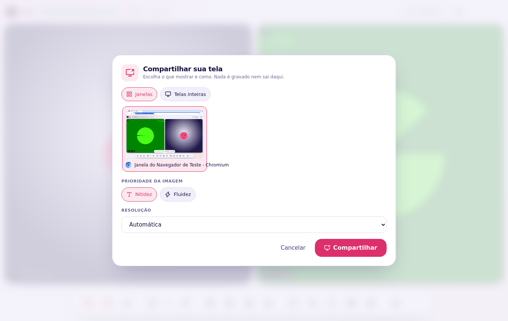
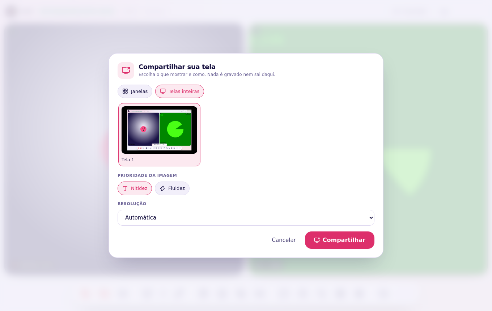
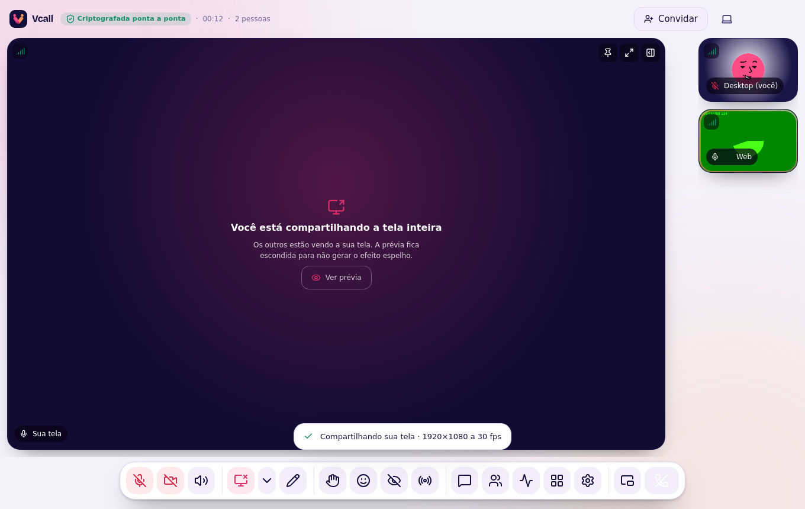

# Compartilhar a tela

Clique em **Compartilhar tela** (`S`).

## No aplicativo (Windows e Linux X11)

O Vcall mostra a lista de verdade: **cada janela aberta** e **cada tela**, com
miniatura. Escolha e clique em **Compartilhar** (ou dê dois cliques).

- **Janela:** os outros veem só aquele programa, mesmo que você mexa em outros.
- **Tela inteira:** tudo o que aparece no monitor. A sua própria prévia fica
  escondida atrás de um aviso para não criar o efeito "sala de espelhos" (que
  pesava no processador e na rede e podia derrubar a chamada). Dá para ver a
  prévia em **Ver prévia**.

## No Linux com Wayland (Fedora, Ubuntu, Arch com GNOME/KDE)

A lista é do **sistema** (xdg-desktop-portal). Ao clicar em Compartilhar, a
janela do GNOME/KDE aparece — escolha a tela ou a janela ali. Se ela não
aparecer, veja [Instalação → Wayland](Instalacao#compartilhar-tela-no-wayland-gnome-kde-plasma-sway-hyprland).

## No navegador

O navegador mostra a lista dele (é uma regra de segurança: nenhum site pode
ver suas janelas sem você escolher). O Vcall já abre essa lista na aba certa.

## Prioridade da imagem

| Opção | Use para | O que acontece quando a rede aperta |
| --- | --- | --- |
| **Nitidez** | Texto, código, planilhas, slides | Perde quadros, mas o texto continua legível |
| **Fluidez** | Vídeo, animação, jogo | Perde resolução, mas não engasga |

A resolução (1080p/720p) e a prioridade podem ser trocadas durante a
transmissão pela setinha ao lado do botão.

## Som

**Desligado por padrão.** Ligue "Compartilhar o som do computador" só quando
for mostrar vídeo ou música, e **use fones**: no Windows o som capturado é o
do computador inteiro, e sem fone as vozes da própria chamada voltam para os
outros como eco. No Linux o sistema não oferece captura de som por janela, e
a opção não aparece.
