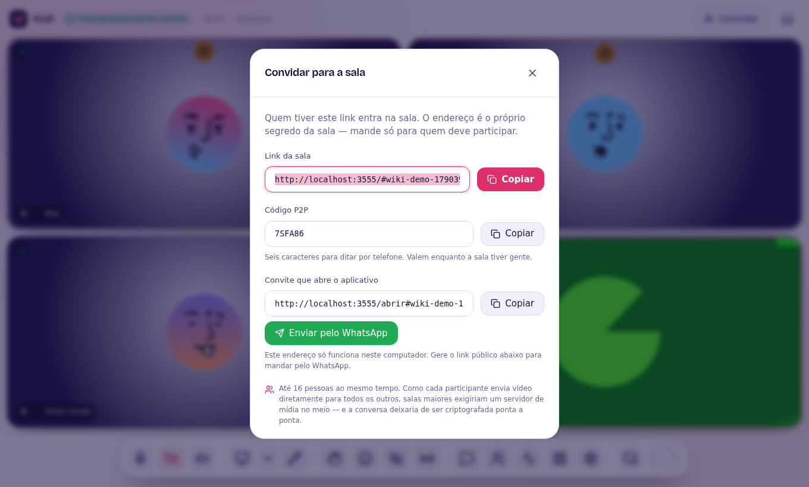
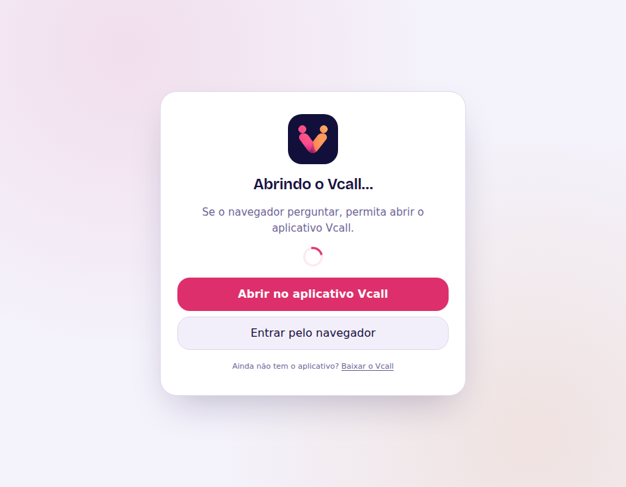

# Convidar e WhatsApp

Clique em **Convidar**, no canto de cima.

| Opção | Quando usar |
| --- | --- |
| **Link da sala** | Mandar por qualquer lugar; abre no navegador |
| **Código P2P** | Ditar por telefone: seis letras, sem letras parecidas (0/O, 1/I/L) |
| **Convite que abre o aplicativo** | **WhatsApp**, Telegram, e-mail: abre direto no app de quem tem o Vcall |
| **Link público pela internet** (app) | Para quem está fora da sua rede |

## Enviar pelo WhatsApp

1. No aplicativo, clique em **Gerar link** em "Link público pela internet"
   (a primeira vez baixa o `cloudflared`, uma vez só).
2. Clique em **Enviar pelo WhatsApp**. O WhatsApp abre com a mensagem pronta.

A mensagem leva um link `https://…/abrir#sala`. No WhatsApp ele é **clicável**
(links `vcall://` não são). Ao clicar:

- **no computador com o Vcall instalado:** o navegador pergunta "Abrir o
  Vcall?" e a chamada abre no aplicativo;
- **no computador sem o Vcall:** a página oferece **Entrar pelo navegador** ou
  **Baixar o Vcall**;
- **no celular:** vai direto para a chamada no navegador.

> O link público muda toda vez que o túnel é reaberto. Um convite antigo para
> de funcionar quando você fecha o Vcall.

## Salas com senha

Quem entra pelo link precisa digitar a senha. Ela é conferida no servidor,
nunca guardada em claro, e tentativas erradas em sequência bloqueiam o
endereço por um tempo.
