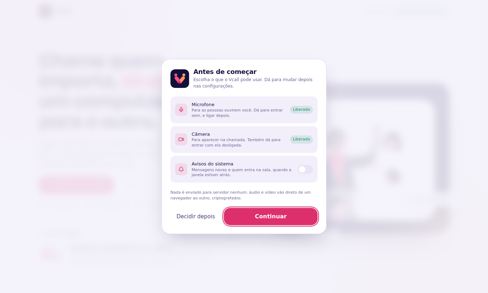

  

<b>Chamadas de vídeo diretas de um computador para o outro — criptografadas, sem conta e sem intermediário.</b>

---

Bem-vindo à wiki do **Vcall**. Aqui está tudo o que você precisa para instalar,
usar, convidar pessoas, moderar uma reunião e resolver problemas — no Windows,
em qualquer distribuição Linux e no navegador.

## Comece por aqui

| Quero… | Página |
| --- | --- |
| Instalar no Windows, Fedora, Arch, Ubuntu… | [Instalação](Instalacao) |
| Fazer a primeira chamada | [Primeiros passos](Primeiros-passos) |
| Mandar o convite pelo WhatsApp | [Convidar e WhatsApp](Convidar-e-WhatsApp) |
| Mostrar uma janela ou a tela inteira | [Compartilhar a tela](Compartilhar-a-tela) |
| Desenhar junto e mandar arquivos | [Canvas e arquivos](Canvas-e-arquivos) |
| Ligar legendas da minha fala | [Legendas](Legendas) |
| Jogar junto: foco na voz, volume, sobreposição | [Jogos e voz](Jogos-e-voz) |
| Silenciar, remover, trancar a sala | [Moderação e sala de espera](Moderacao-e-sala-de-espera) |
| Algo não funciona | [Solução de problemas](Solucao-de-problemas) |
| Entender o que é privado | [Segurança e privacidade](Seguranca-e-privacidade) |
| Mexer no código, rodar os testes | [Para desenvolvedores](Para-desenvolvedores) |
| Ver o que mudou | [Novidades da 3.1](Novidades-3.1) |

## O que o Vcall faz

- **Vídeo, voz e tela ponto a ponto.** O servidor só apresenta os
  participantes; áudio, vídeo, tela, chat, canvas e arquivos vão direto de um
  computador ao outro, cifrados por DTLS-SRTP.
- **Até 16 pessoas por sala**, sem limite de tempo e sem conta.
- **Compartilhar uma janela específica** ou a tela inteira, com qualidade
  escolhida para texto (nitidez) ou vídeo (fluidez).
- **Canvas colaborativo infinito** com caneta, formas, notas, imagens e
  anotação por cima da tela compartilhada.
- **Chat com arquivos** de até 25 MB, entregues inteiros e na ordem.
- **Legendas ao vivo** da própria fala — no aplicativo, reconhecidas no seu
  computador, sem enviar áudio a ninguém.
- **Moderação de verdade**: silenciar, desligar câmera, remover, trancar a
  sala e **sala de espera** com aprovação do anfitrião.
- **Foco na voz** estilo Discord (quem fala acende, quem está calado apaga), **rampa de volume** por pessoa e **modo jogo** com sobreposição e atalhos globais.
- **Convite clicável no WhatsApp** que abre direto no aplicativo.
- **Aplicativo para Windows e Linux** (AppImage, .deb, .rpm, pacman, .tar.gz)
  e funcionamento completo no navegador.

## Baixar

Os instaladores ficam na página de
[**Releases**](https://github.com/victor-kauan-coder/Vcall/releases/latest).
Veja qual arquivo escolher em [Instalação](Instalacao).
