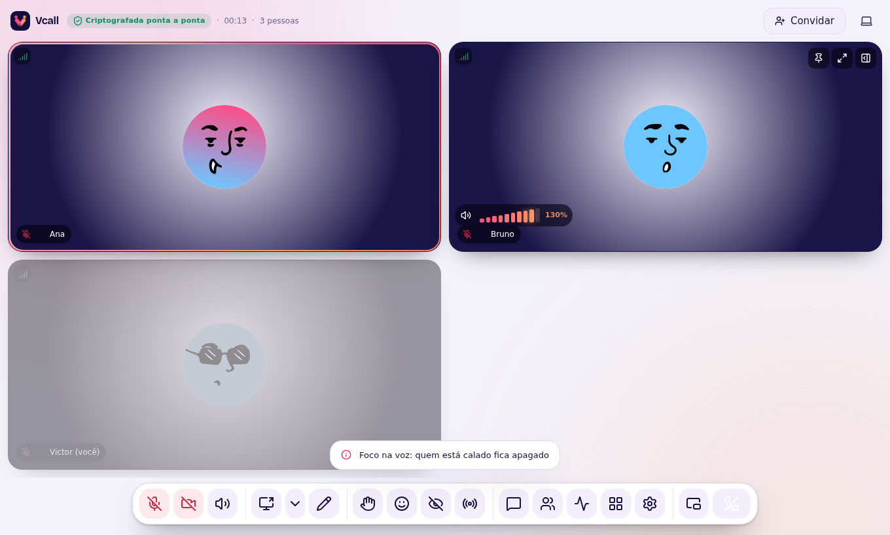
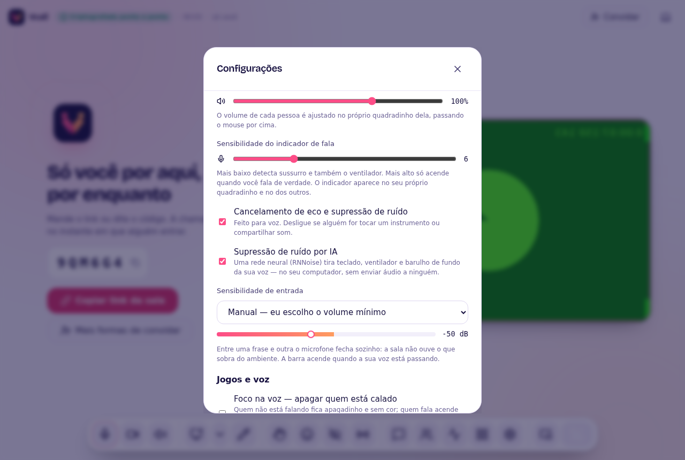
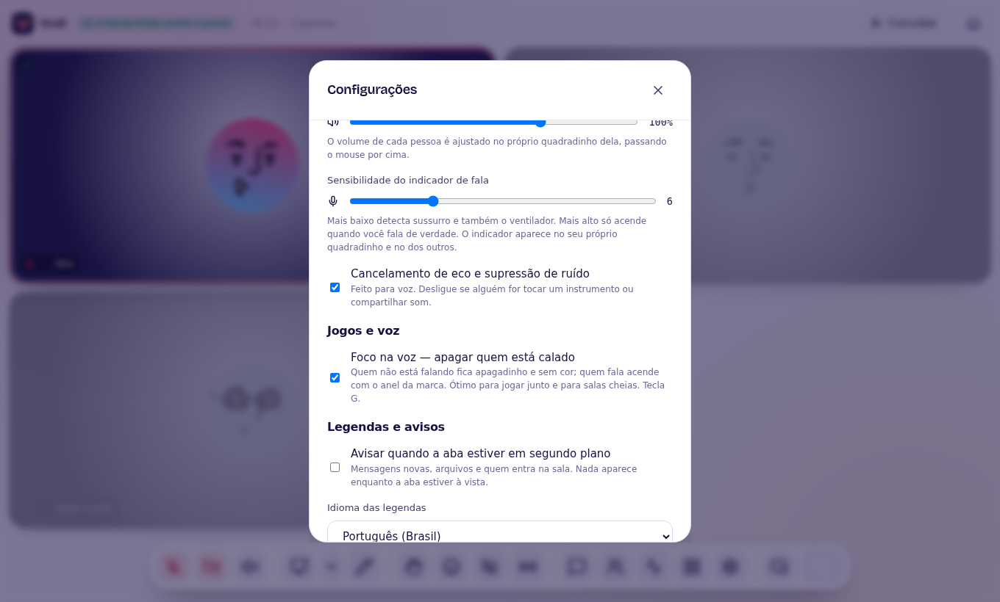

# Jogos e voz

Recursos pensados para jogar junto — ou para qualquer sala cheia em que o que
importa é saber **quem está falando agora**.

## Foco na voz (tecla `G`)

Parecido com o Discord: quem está calado fica **apagadinho** (transparente e sem
cor) e quem fala **acende** na hora, com o anel animado nas cores do Vcall. Passar
o mouse sobre alguém acende a pessoa para você mexer no volume dela.

Liga de três jeitos: tecla **`G`**, menu **⋯ → Foco na voz**, ou em
**Configurações → Jogos e voz**. A escolha fica guardada para as próximas
chamadas.

## Volume de cada pessoa

Passe o mouse sobre o quadrinho de alguém: aparece a **rampa de volume** do
Vcall — dez barras que sobem da esquerda para a direita no degradê rosa → laranja
da marca. Arraste ou use as setas do teclado:

- de **0% a 150%** (acima de 100% é ganho: as últimas barras brilham);
- em **0%** a rampa apaga e mostra *mudo* — só para você, a pessoa não sabe;
- o ícone do alto-falante silencia/volta com um clique.

## Supressão de ruído por IA

Configurações → Áudio → **Supressão de ruído por IA** (ligada por padrão).
Uma rede neural (RNNoise) separa a sua voz do resto: teclado mecânico, mouse,
ventilador, ar-condicionado, cachorro. Parecido com o Krisp do Discord, mas
roda **no seu computador**, sem mandar áudio para servidor nenhum.

## Sensibilidade de entrada

Configurações → Áudio → **Sensibilidade de entrada**. Entre uma frase e outra
o microfone fecha sozinho: a sala não ouve respiração nem o barulho que sobrou.

- **Automática** (padrão): a IA decide o que é voz.
- **Manual**: você escolhe o volume mínimo, em dB. A barra mostra o seu volume
  ao vivo e acende em rosa/laranja quando a voz está passando, como no Discord.
- **Desligada**: o microfone transmite sempre.

O começo das frases não é cortado: o portão abre 30 ms antes de a voz passar.

## Economia de banda

Quando a sua janela fica minimizada ou escondida (outra aba, jogo em tela
cheia) por mais de 5 segundos, os outros param de enviar **câmera** para você.
Voz e tela compartilhada continuam. Ao voltar, a câmera volta na hora. Com a
mini-janela aberta nada muda, porque você ainda está assistindo.

## Modo jogo (app de mesa)

Só no aplicativo de Windows e Linux. Em **⋯ → Modo jogo** ou
**Configurações → Jogos e voz**:

- **Sobreposição** — uma lista transparente, sempre por cima de tudo (inclusive
  do jogo em janela ou tela cheia sem bordas), com quem está na chamada. Quem
  fala acende; quem está mudo mostra o microfone cortado. Os cliques passam
  direto para o jogo. Escolha o canto da tela nas configurações.
- **Atalhos globais**, que funcionam mesmo com o jogo em foco:
  - **`Ctrl+Shift+M`** — liga/desliga o microfone;
  - **`Ctrl+Shift+O`** — mostra/esconde a sobreposição.

Se outro programa já usa um desses atalhos, o Vcall avisa que não conseguiu
registrá-lo (o resto funciona normalmente).

> **Linux/Wayland:** alguns compositores não deixam uma janela ficar por cima de
> um jogo em tela cheia *exclusiva*. Use tela cheia sem bordas ("borderless") ou
> janela maximizada. Atalhos globais no Wayland dependem do compositor; no X11
> funcionam sempre.

