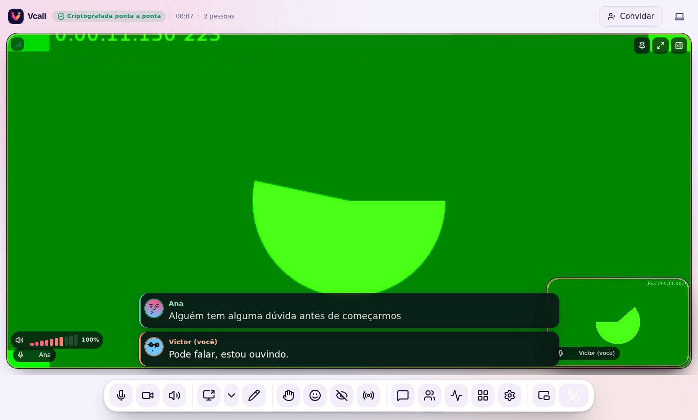
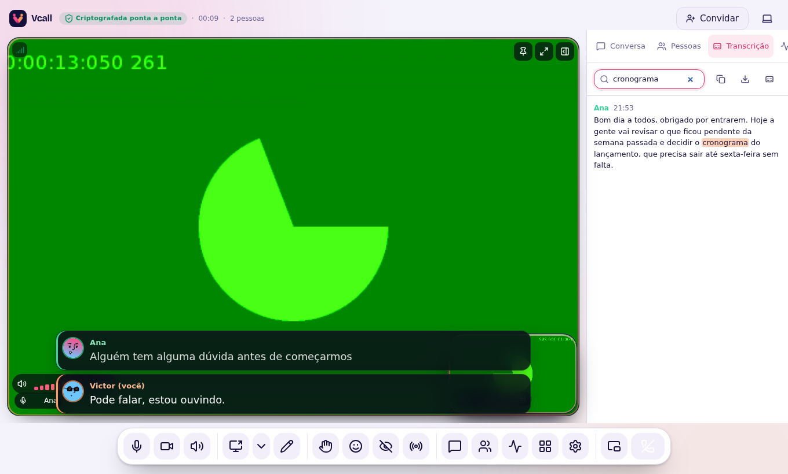

# Legendas e transcrição

O botão de legenda (`T`) transcreve **a sua fala** e mostra o texto para todos
na sala. Cada pessoa legenda a própria voz; o texto viaja como texto (alguns
bytes), nunca como áudio.

Cada fala aparece com a **foto e a cor da pessoa**, em no máximo duas linhas.
Frases longas rolam como na TV: o começo sai por cima. Enquanto a frase ainda
está sendo dita, um cursor pisca no fim. O tamanho (pequena, média ou grande)
fica em Configurações → Legendas e avisos.

## No aplicativo: Whisper, no seu computador

Desde a 3.3 o app reconhece a fala com o **Whisper**, o mesmo modelo de
reconhecimento usado em serviços profissionais de transcrição. Ele roda **no
seu computador**: nenhum áudio sai daqui, só o texto vai para a sala. Ele
acerta frases inteiras, com pontuação. O reconhecedor anterior (Vosk pequeno)
errava muito em português, e continua existindo só como reserva.

Na primeira vez o modelo é baixado, uma vez só, com o progresso na tela. Três
níveis de precisão, em Configurações → Legendas e avisos → **Precisão das
legendas**:

| Nível | Download | Para quem |
| --- | --- | --- |
| Rápida | ~40 MB | computadores modestos |
| **Equilibrada** (padrão) | ~80 MB | a maioria |
| Máxima | ~250 MB | computadores fortes, a mais precisa |

A legenda aparece conforme você fala e é corrigida no fim da frase, quando sai
o texto definitivo (é esse que entra na transcrição). O app usa vários núcleos
do processador para isso.

## No navegador

Usa o reconhecimento do Chrome ou do Edge. Em outros navegadores o botão avisa
que não há reconhecimento — mas você continua **lendo** as legendas de quem
estiver legendando.

## Transcrição ao vivo

Menu **⋯ → Transcrição ao vivo**, ou a aba **Transcrição** do painel lateral:
tudo o que foi dito na chamada, com nome e horário, atualizado ao vivo.

- **Buscar**: digite uma palavra e as falas que a contêm aparecem com o termo
  destacado.
- **Copiar tudo**, **Baixar (.txt)** e **Baixar como legenda (.srt)** — o .srt
  abre em qualquer player junto com a gravação da reunião.

## Idioma

Configurações → Legendas e avisos → **Idioma das legendas**. O padrão é
**português (Brasil)**.

## Privacidade

Com o **microfone mudo, a legenda para**. Nada do que você diz com o
microfone desligado é transcrito nem enviado.
