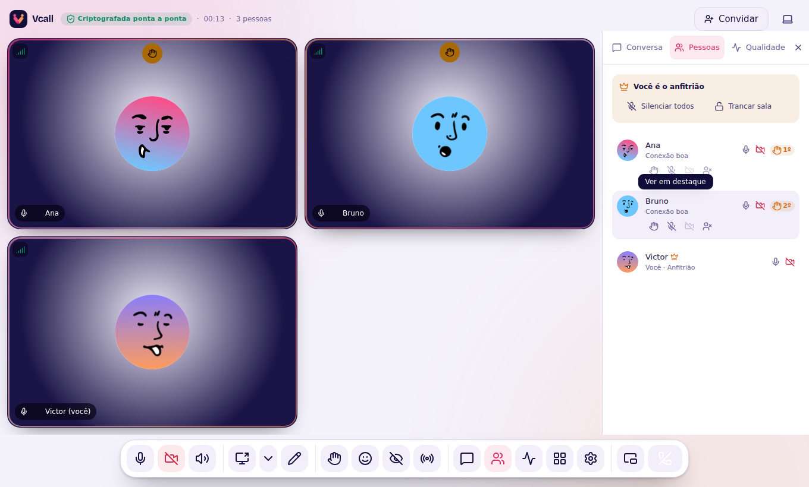
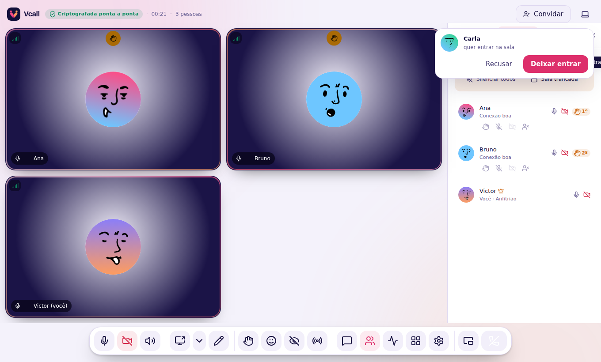
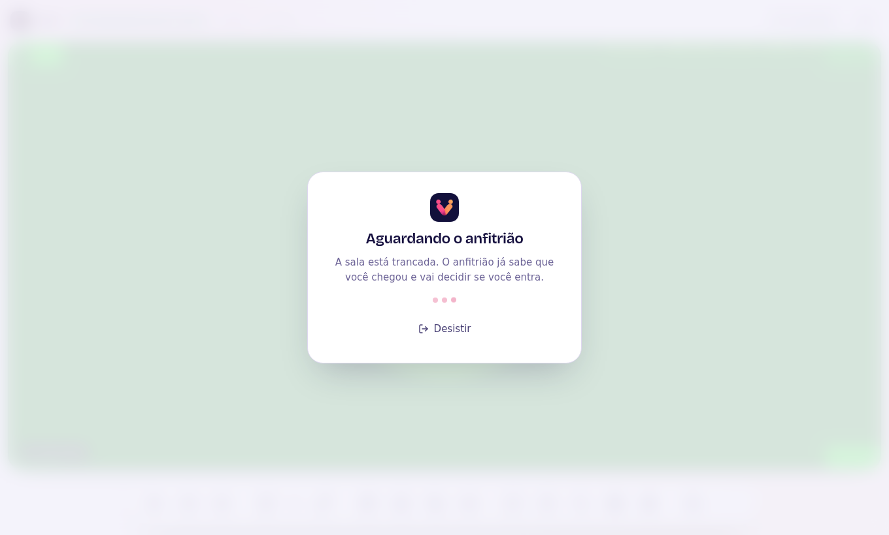

# Moderação e sala de espera

Quem cria a sala é o **anfitrião** (coroa ao lado do nome). Os controles
ficam na aba **Pessoas** (`P`). Tudo é conferido no **servidor**: mesmo um
programa modificado não consegue silenciar ou remover ninguém sem ser o
anfitrião.

| Ação | O que acontece |
| --- | --- |
| **Silenciar** | Desliga o microfone da pessoa. Ela pode religar quando quiser falar. |
| **Silenciar todos** | O mesmo, para todos de uma vez. |
| **Desligar câmera** | Desliga a câmera da pessoa. |
| **Baixar a mão** | Tira a pessoa da fila de mãos levantadas. |
| **Remover da sala** | Tira a pessoa na hora (com confirmação). Ela não volta pelo mesmo aparelho enquanto a sala existir. |
| **Trancar sala** | Ninguém novo entra direto: quem chega vai para a **sala de espera**. |

## Deixar voltar quem foi removido

Removeu alguém por engano, ou a pessoa pediu desculpas? Logo depois de
remover aparece **Deixar voltar** no aviso. A qualquer momento, em
**Pessoas → Removidos da sala**, clique em **Deixar voltar**. A pessoa clica em
**Tentar entrar de novo** na tela dela (ou abre o link da sala) e entra. Só o
anfitrião vê essa lista, e ela não mostra nenhum identificador do aparelho de
ninguém.

## Sala de espera

Com a sala trancada, quem chega vê "Aguardando o anfitrião" e o anfitrião
recebe um cartão com **Deixar entrar** e **Recusar**. Destrancar a sala deixa
entrar todos que estavam esperando.

## Fila de mãos

Quem levanta a mão (`H`) entra numa **fila por ordem de chegada** — 1º, 2º,
3º… — no topo da lista de pessoas.

## Tempo de fala

A lista mostra há quanto tempo cada um falou (a partir de meio minuto), útil
para dar a vez a quem ainda não falou. Isso é medido só na sua tela.

## Se o anfitrião cair

A conexão volta sozinha e ele continua anfitrião. Se ele sair de vez, o papel
passa para quem está há mais tempo na sala.
