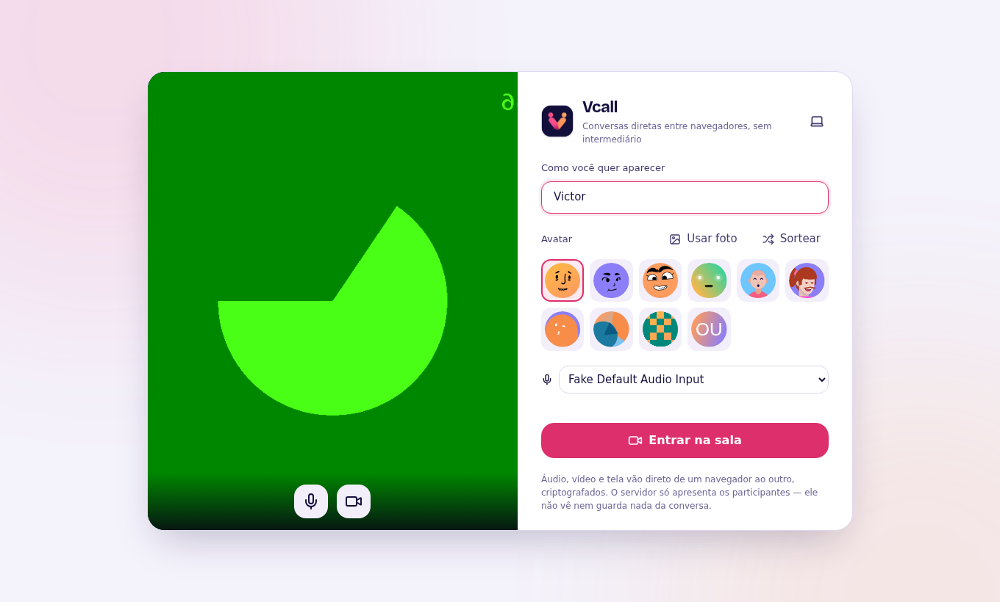
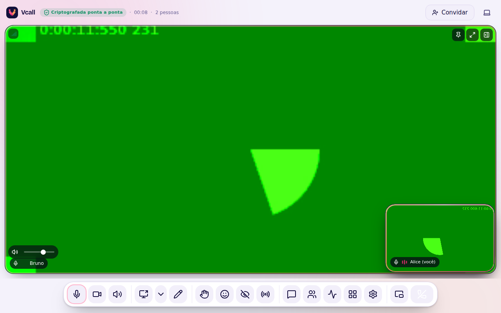
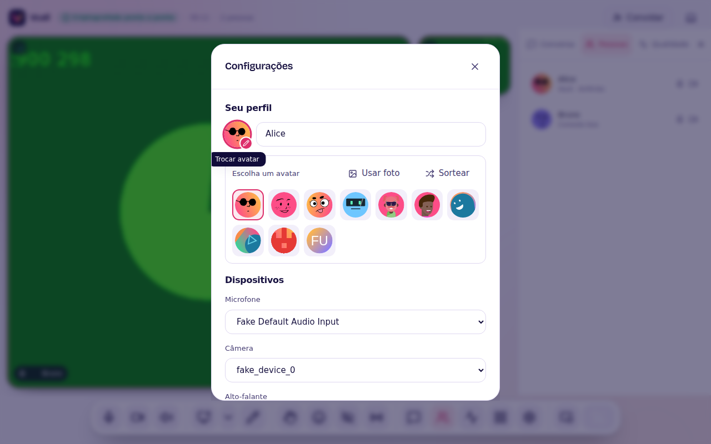

# Primeiros passos

## 1. Criar a sala

Abra o Vcall e clique em **Criar nova call**. Dê um nome (opcional), escolha
se ela é **privada** (só entra quem tem o link ou o código) ou **pública**
(aparece em "Ao vivo agora" no painel inicial) e, se quiser, uma **senha**.

Quem cria a sala é o **anfitrião**: é quem pode silenciar, remover, trancar e
aprovar quem está na sala de espera. Se a sua conexão cair, você volta como
anfitrião automaticamente.

## 2. O saguão

Antes de entrar você se vê, escolhe o nome, o avatar (ou uma foto sua) e o
microfone. A câmera e o microfone podem começar desligados.

## 3. Na chamada

| Botão | O que faz | Atalho |
| --- | --- | --- |
| Microfone | Liga/desliga a sua voz | `M` (segure `Espaço` para falar) |
| Câmera | Liga/desliga o seu vídeo | `V` |
| Alto-falante | Silencia todo mundo para você | `D` |
| Compartilhar tela | Janela ou tela inteira | `S` |
| Lápis | Canvas colaborativo / anotar a tela | `Q` |
| Mão | Levantar a mão (entra na fila) | `H` |
| Legenda | Legenda da sua fala | `T` |
| Conversa | Chat e arquivos | `C` |
| Pessoas | Lista, fila de mãos, moderação | `P` |
| Grade | Alterna destaque/grade | `L` |
| Mini-janela | Janela pequena sempre por cima | `J` |

`?` mostra todos os atalhos. Com uma janela de diálogo aberta, as teclas são
dela — `Esc` fecha.

## 4. Chamada a dois

Com só duas pessoas, a outra ocupa a tela inteira e o seu vídeo vira um
**balão flutuante**. Arraste o balão para qualquer canto: ele desliza até o
mais próximo. Prefere lado a lado? Clique no botão de grade (`L`).

## 5. Seu perfil

Clique no seu nome na aba **Pessoas** (ou em Configurações → Seu perfil) e
depois no avatar para trocar de estilo, sortear outro ou usar uma foto. A
troca vale na hora para todo mundo.

